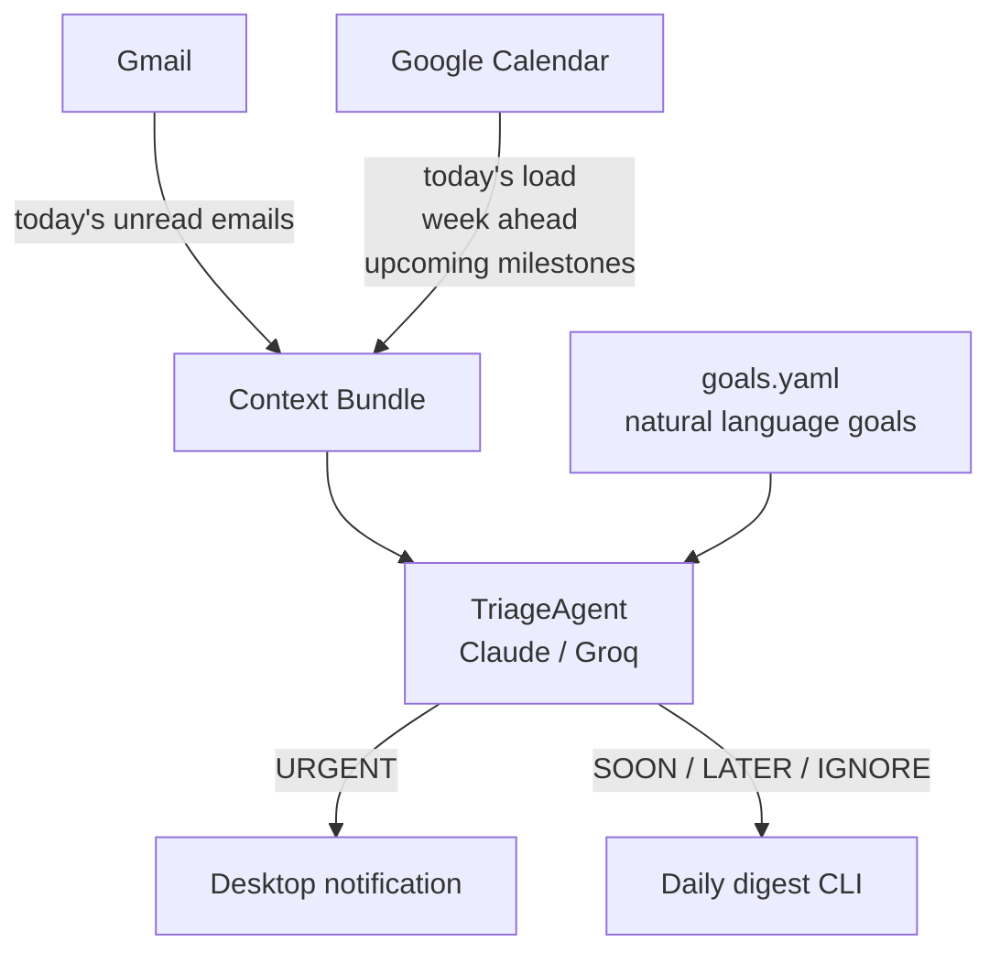

# Attune

> Stay attuned to your goals. No distractions.

An AI assistant that triages your inbox against what you actually care about — not just keyword rules, but your current goals, deadlines, and how your week looks.

---

## The problem with existing tools

Tools like Superhuman let you define static priorities ("emails from my manager are important"). But urgency is not a property of an email — it's a function of **context**.

The same email from your supervisor can be:
- `LATER` — if you have 6 months until your deadline and the week is light
- `URGENT` — if the deadline is in 8 days and you're already slammed

No existing tool reasons about this. Attune does.

---

## How it works



### Goals — natural language, not rules

Instead of configuring sender filters or keywords, you write what you actually care about:

```yaml
goals:
  - I am finishing my PhD thesis. Defense is in July 2026.
    Supervisor feedback and committee emails are critical.
    Anything related to the viva or thesis corrections is high priority.
  - I am applying for postdoc positions and research grants.
    Funding decisions and grant deadlines are urgent.
  - I am building a side project with a collaborator.
    Messages about the project are important.
  - Physical activity and social plans with close friends matter.
    Let those through, but they are rarely urgent.
```

The LLM interprets these. No maintenance, no missed edge cases.

### Calendar context — three layers

Before triaging a single email, Attune checks:

| Layer | What it captures |
|---|---|
| **Today's load** | How many hours are blocked today |
| **Week ahead** | Busyness per day for the next 7 days |
| **Upcoming milestones** | Named deadlines in the next 60 days and how far away they are |

This lets the agent reason: *"Your deadline is in 12 days and you're fully booked this week — anything related to that project escalates."*

### Labels — URGENT means interrupt me now

| Label | Meaning |
|---|---|
| `URGENT` | Stop what you're doing. Action required, delay is costly. 0–2 per day max. |
| `SOON` | Read today, respond before EOD |
| `LATER` | This week, no immediate pressure |
| `IGNORE` | Not worth your time |

`URGENT` triggers an OS desktop notification. Everything else goes into the daily digest.

---

## How a decision is made

Here's a concrete example of how the system reasons about a single email:

```
┌─────────────────────────────────────────────────────────┐
│  CALENDAR CONTEXT                                       │
│                                                         │
│  Today (Fri): moderate — 3.5h blocked                  │
│    10:00 Thesis writing block                           │
│    14:00 Lab meeting                                    │
│    16:00 Supervisor check-in                            │
│                                                         │
│  Week ahead:  Sat:L  Sun:L  Mon:L  Tue:H  Wed:M  Thu:M │
│                                                         │
│  Milestones:  Veni grant deadline      →  2 days away  │
│               Chapter 3 submission     →  3 days away  │
│               Thesis committee review  → 18 days away  │
│               PhD defense              → 74 days away  │
└─────────────────────────────────────────────────────────┘
                           +
┌─────────────────────────────────────────────────────────┐
│  GOALS                                                  │
│                                                         │
│  • Finishing PhD thesis — defense July 2026             │
│    Supervisor and committee feedback are critical       │
│  • Applying for postdoc positions and grants            │
│    Funding deadlines are urgent                         │
└─────────────────────────────────────────────────────────┘
                           +
┌─────────────────────────────────────────────────────────┐
│  INCOMING EMAIL                                         │
│                                                         │
│  From:    supervisor@university.edu                     │
│  Subject: Chapter 3 feedback — revise before Thursday  │
│  Body:    "...fix statistical analysis in 3.2...        │
│            committee meets Friday, need it by           │
│            Thursday morning at the latest..."           │
└─────────────────────────────────────────────────────────┘
                           ↓
                    [ TriageAgent ]
                           ↓
┌─────────────────────────────────────────────────────────┐
│  🔴 URGENT                                              │
│                                                         │
│  Action required (revision) + deadline is Thursday,    │
│  3 days away. Committee slot is at risk. With defense   │
│  in 74 days, supervisor sign-off is on the critical    │
│  path. Delay has real cost.                             │
│                                                         │
│  → Desktop notification sent                           │
└─────────────────────────────────────────────────────────┘
```

The same email with a different calendar context would get a different label:

```
  Milestones: PhD defense → 8 months away (not 74 days)
              Chapter 3 submission → not yet scheduled

  → 🟡 SOON   Supervisor feedback is valuable but not on the
              critical path yet. Read today, no need to stop
              everything.
```

Same email. Different context. Different label.

---

## Preliminary results (mock run)

Running `attune digest --mock` against 25 realistic emails with a simulated PhD student calendar:

```
── TODAY'S DIGEST (Fri May 1) ──────────────────────────────────
  Today: moderate  ·  Week ahead: L H M M L L L
  Milestones: Veni grant in 2d · Chapter 3 in 3d · Postdoc in 4d · ICML in 5d · Defense in 74d

  🔴 URGENT   Prof. Martinez · Chapter 3 feedback — revise before Thursday
             → Action required + committee slot at risk, deadline in 3 days

  🔴 URGENT   Research Foundation · Veni grant portal closes in 48 hours
             → Grant deadline in 2 days, incomplete applications not reviewed

  🔴 URGENT   Dr. Sarah Chen · Postdoc position — need to know by Friday
             → Postdoc application deadline in 4 days, competitive opportunity

  🟡 SOON     ICML 2026 · Paper submission deadline — 5 days remaining
             → Submission required, deadline in 5 days

  🟡 SOON     JMLR · Review request: manuscript #4821 — respond within 3 days
             → Accept/decline required within 3 days

  🔵 LATER    Jamie · Attune — reranker idea, worth a call this week?
             → Side project discussion, no deadline pressure

  🔵 LATER    Anna Kowalski · Collaboration on causal inference
             → Interesting but no deadline given current milestones

  🔵 LATER    Grants Office · Travel grant — open until May 31
             → Worthwhile but deadline is 30 days away

  ⚪ IGNORE   Medium · 5 AI papers you should read this week
  ⚪ IGNORE   LinkedIn · You appeared in 14 searches this week
  ⚪ IGNORE   Arxiv · cs.LG — 47 new submissions
  ⚪ IGNORE   Canteen Services · This week's lunch menu
  ... (and 13 more)
────────────────────────────────────────────────────────────────
  25 emails  ·  3 urgent · 2 read today · 8 this week · 12 ignored
```

---

## What's next

### Reranker
Replace the prompted LLM with a trained **cross-encoder reranker**: goals as query, emails as documents. Train on synthetic (goal, email, relevance) triplets. Faster, cheaper, and potentially more consistent than prompted inference.

### Outlook + Teams connector
Same triage core, different adapter.

### Multi-channel
Slack, WhatsApp, Teams — same value-of-information judge, different connectors.

### Continuous mode
Run in the background, fetch new emails every N minutes, only surface `URGENT` ones in real time.

---

## Run it yourself

```bash
git clone https://github.com/franciscoambrosio/attune
cd attune
python3 -m venv .venv && source .venv/bin/activate
pip install -e .

# Add your Groq or Anthropic key
cp .env.example .env && nano .env

# Edit your goals
nano config/goals.yaml

# Try the mock (no Google auth needed)
attune digest --mock

# Or against your real Gmail (requires Google Cloud credentials)
attune digest
```

---

## Stack

- **LLM**: Groq `llama-3.1-8b-instant` (dev) → Claude Haiku (production)
- **Google APIs**: Gmail + Calendar via OAuth
- **CLI**: Click
- **Config**: PyYAML (goals) + python-dotenv
