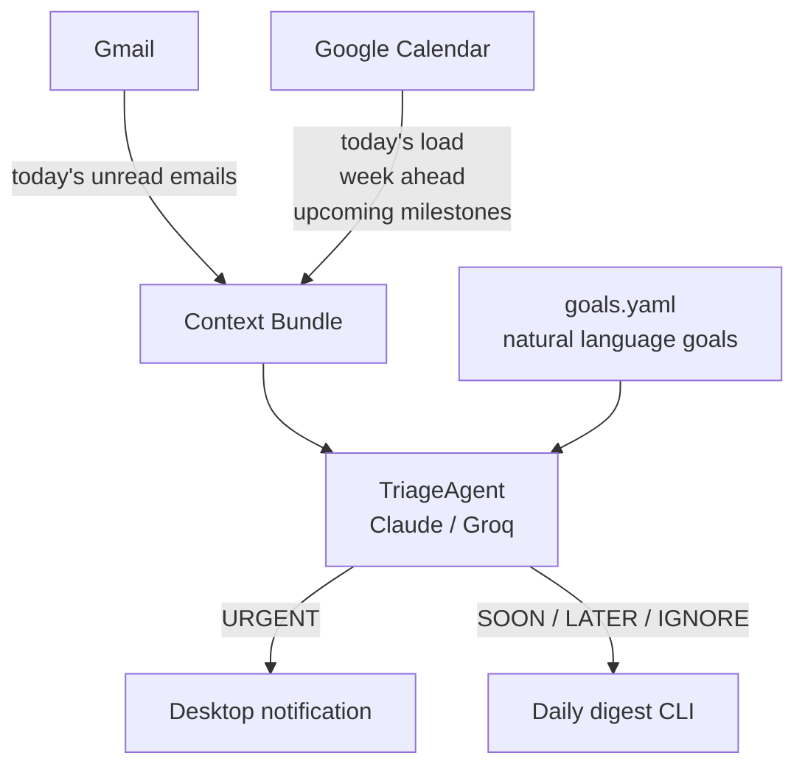

# Attune

> Stay attuned to your goals. No distractions.

An AI assistant that triages your inbox against what you actually care about — not just keyword rules, but your current goals, deadlines, and how your week looks.

---

## The problem with existing tools

Tools like Superhuman let you define static priorities ("emails from my manager are important"). But urgency is not a property of an email — it's a function of **context**.

The same email from your supervisor can be:
- `LATER` — if you have 6 months until your deadline and the week is light
- `URGENT` — if the deadline is in 8 days and you're already slammed

No existing tool reasons about this. Attune does.

---

## How it works



### Goals — natural language, not rules

Instead of configuring sender filters or keywords, you write what you actually care about:

```yaml
goals:
  - I am finishing my PhD thesis. Defense is in July 2026.
    Supervisor feedback and committee emails are critical.
    Anything related to the viva or thesis corrections is high priority.
  - I am applying for postdoc positions and research grants.
    Funding decisions and grant deadlines are urgent.
  - I am building a side project with a collaborator.
    Messages about the project are important.
  - Physical activity and social plans with close friends matter.
    Let those through, but they are rarely urgent.
```

The LLM interprets these. No maintenance, no missed edge cases.

### Calendar context — three layers

Before triaging a single email, Attune checks:

| Layer | What it captures |
|---|---|
| **Today's load** | How many hours are blocked today |
| **Week ahead** | Busyness per day for the next 7 days |
| **Upcoming milestones** | Named deadlines in the next 60 days and how far away they are |

This lets the agent reason: *"Your deadline is in 12 days and you're fully booked this week — anything related to that project escalates."*

### Labels — URGENT means interrupt me now

| Label | Meaning |
|---|---|
| `URGENT` | Stop what you're doing. Action required, delay is costly. 0–2 per day max. |
| `SOON` | Read today, respond before EOD |
| `LATER` | This week, no immediate pressure |
| `IGNORE` | Not worth your time |

`URGENT` triggers an OS desktop notification. Everything else goes into the daily digest.

---

## Preliminary results (mock run)

Running `attune digest --mock` against 8 realistic emails with a simulated calendar
(committee review in 18 days, grant deadline in 2 days, final review in 74 days):

```
── TODAY'S DIGEST (Fri May 1) ────────────────────────────
  Today: moderate  ·  Week ahead: L H L M L L L
  Milestones: Veni grant deadline in 2d  ·  Chapter 3 in 3d  ·  PhD defense in 74d

  🔴 URGENT   Research Foundation · Veni Grant portal closes in 48 hours
             → Grant deadline in 2 days, late submissions not accepted

  🔴 URGENT   Prof. Martinez · Chapter 3 feedback — revise before Thursday
             → Revision needed before committee review in 18 days and defense in 74 days

  🟡 SOON     Dr. Sarah Chen · Postdoc position — still interested?
             → Action required: send CV + research statement before next week

  🔵 LATER    Jamie · Attune — idea for the reranker architecture
             → Project discussion, no deadline pressure

  🔵 LATER    University Library · Loan due in 3 days
             → No impact on thesis or grant deadlines

  ⚪ IGNORE   Medium Daily Digest · 5 AI papers this week
────────────────────────────────────────────────────────────
  8 emails  ·  2 urgent · 1 read today · 2 this week · 1 ignored
```

The reasoning is goal-linked — every label references a specific goal or deadline, not just the email content.

---

## What's next

### Reranker
Replace the prompted LLM with a trained **cross-encoder reranker**: goals as query, emails as documents. Train on synthetic (goal, email, relevance) triplets. Faster, cheaper, and potentially more consistent than prompted inference.

### Outlook + Teams connector
Same triage core, different adapter.

### Multi-channel
Slack, WhatsApp, Teams — same value-of-information judge, different connectors.

### Continuous mode
Run in the background, fetch new emails every N minutes, only surface `URGENT` ones in real time.

---

## Run it yourself

```bash
git clone https://github.com/franciscoambrosio/attune
cd attune
python3 -m venv .venv && source .venv/bin/activate
pip install -e .

# Add your Groq or Anthropic key
cp .env.example .env && nano .env

# Edit your goals
nano config/goals.yaml

# Try the mock (no Google auth needed)
attune digest --mock

# Or against your real Gmail (requires Google Cloud credentials)
attune digest
```

---

## Stack

- **LLM**: Groq `llama-3.1-8b-instant` (dev) → Claude Haiku (production)
- **Google APIs**: Gmail + Calendar via OAuth
- **CLI**: Click
- **Config**: PyYAML (goals) + python-dotenv
